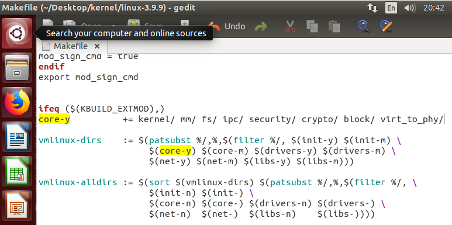
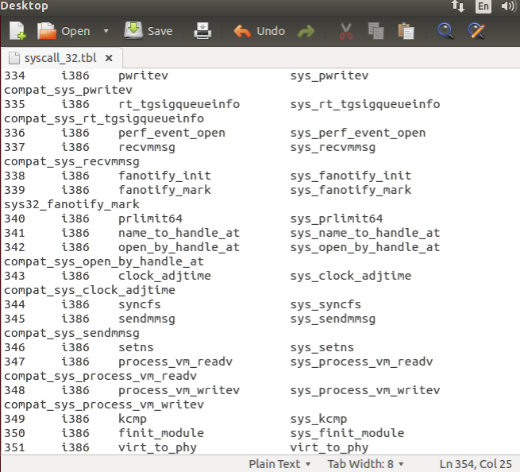
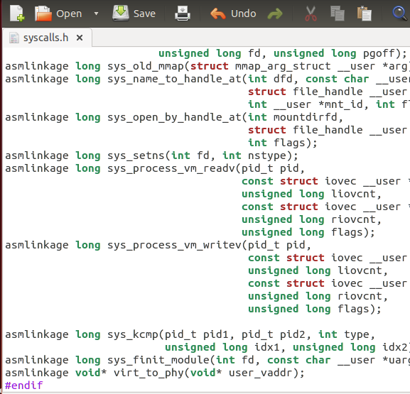
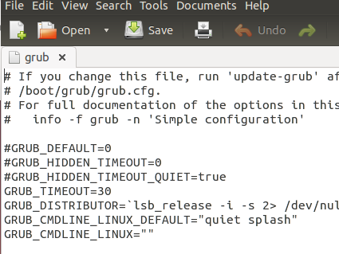
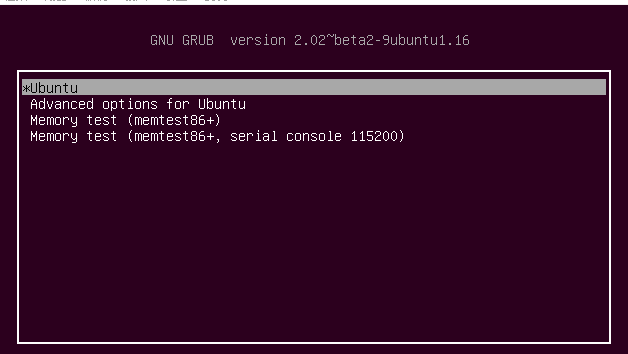
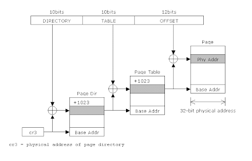
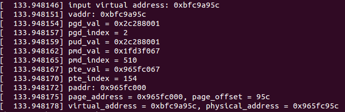
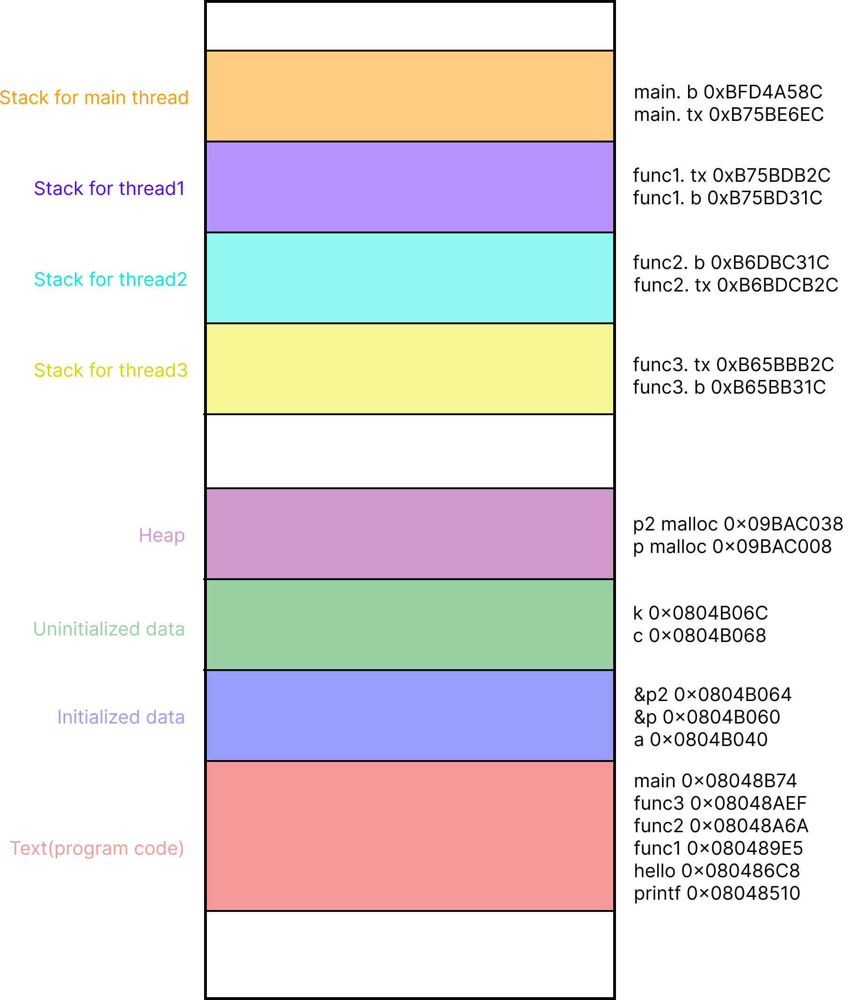

# Implement a System Call on Linux Kernel 3.9.9 to Get Physical Address by Virtual address


## 說明

此專案為 NCU Linux 2023 Fall 課程的 Project1，需要實作一個從 user space 取得的 virtual/logical address 轉換成 physical address 的 system call，並寫一個有 3 個 threads 的 multi-thread 程式使用製作的 system call 查看程式執行時記憶體分區情況並畫成圖形展示。

[Project Description](https://staff.csie.ncu.edu.tw/hsufh/COURSES/FALL2023/linux_project_1.html)


## 要求

1. In this project, **you need to write a new system call `void * my_get_physical_addresses(void *)`** so that a process can use it to **get the physical address of a virtual address of a process.** The return value of this system call is either 0 or an address value. 0 means that an error occurs when executing this system call. A non-zero value means the physical address of the logical address submitted to the system call as its parameter.

2. Write a multi-thread program with three threads using the new system call to show how the following memory areas are shared by these threads. Your program must use variables with storage class __thread. The memory areas include code segments, data segments, BSS segments, heap segments, libraries, stack segments, and thread local storages. **You need to draw a figure as follows to show your results.**


## 環境版本

+ VM: [Oracle VirtualBox 7.0.12 r159484](https://download.virtualbox.org/virtualbox/7.0.12/)
+ OS: [Ubuntu 14.04.6 LTS (Trusty Tahr) 32-bit PC (i386) desktop image](https://releases.ubuntu.com/trusty/)
+ Kernel: [linux-3.9.9](https://mirrors.edge.kernel.org/pub/linux/kernel/v3.x/linux-3.9.9.tar.gz)


## 環境準備

+ 於 VirtualBox 中新增虛擬機後需要先將帳戶新增 super user 的權限，使我們能夠使用 sudo，可使用以下方法新增 ([Ref. 1](https://superuser.com/a/1755286))

  


## 新增 System Call

1. 下載 linux kernel 3.9.9 源碼並解壓縮
    ``` bash
    ~$ cd Desktop
    ~/Desktop$ mkdir kernel
    ~/Desktop$ cd kernel/
    ~/Desktop/kernel$ wget https://mirrors.edge.kernel.org/pub/linux/kernel/v3.x/linux-3.9.9.tar.gz --no-check-certificate
    ~/Desktop/kernel$ tar zxvf linux-3.9.9.tar.gz 
    ```

2. 於 "linux-3.9.9" 中新增一個存放 system call 的資料夾，並放入寫好的 system call 程式碼 [virt_to_phy.c](#實作程式碼)，之後新增 "Makefile" 並寫入 `obj-y := virt_to_phy.o`

    ``` bash
    ~/Desktop/kernel/linux-3.9.9$ mkdir virt_to_phy
    ~/Desktop/kernel/linux-3.9.9$ cd virt_to_phy/
    ~/Desktop/kernel/linux-3.9.9/virt_to_phy$ gedit virt_to_phy.c
    ~/Desktop/kernel/linux-3.9.9/virt_to_phy$ gedit Makefile
    ```
    
    

3. 修改於 "linux-3.9.9" 中的 "Makefile" 找到在 `ifeq ($(KBUILD_EXTMOD),)` 下的 core-y，並於最後貼上剛剛新增的資料夾 "virt_to_phy/"
    
    ``` bash
    ~/Desktop/kernel/linux-3.9.9/virt_to_phy$ cd ..
    ~/Desktop/kernel/linux-3.9.9$ gedit Makefile
    ```
    
    
    
4. 於 "syscall_32.tbl" 檔案中最後一行新增 system call

    ``` bash
    ~/Desktop/kernel/linux-3.9.9$ gedit arch/x86/syscalls/syscall_32.tbl 
    ```
    
    
    
5. 於 "syscalls.h" 檔案中最後一行 (#endif 前) 新增 system call
    
    ``` bash
    ~/Desktop/kernel/linux-3.9.9$ gedit include/linux/syscalls.h
    ```

    
    
    
## kernel 編譯

1. 安裝編譯所需套件

    ``` bash
    ~/Desktop/kernel/linux-3.9.9$ sudo apt-get update -y
    ~/Desktop/kernel/linux-3.9.9$ sudo apt-get install build-essential libncurses5 libncurses5-dev -y
    ```

2. 設定編譯選項
    
    ``` bash
    ~/Desktop/kernel/linux-3.9.9$ make menuconfig
    ```

    將 Processor type and fetures > Supervisor Mode Access Prevention 設定關閉
    這個設定是保護 user-space 和 kernel-space 之間的記憶體不能「直接」互相存取
    完成後 Save 並 Exit 即可

3. 編譯並安裝

    設定完成後直接編譯即可，-j 表示編譯時使用的核心數，理論上越多核心編譯越快，編譯後直接安裝

    ``` bash
    ~/Desktop/kernel/linux-3.9.9$ sudo make -j8
    ~/Desktop/kernel/linux-3.9.9$ sudo make modules_install -j8
    ~/Desktop/kernel/linux-3.9.9$ sudo make install -j8
    ```

4. 修改 grub

    修改 "/etc/default/grub" 使我們在開機時能夠選擇我們自己安裝的 kernel

    ``` bash
    ~/Desktop/kernel/linux-3.9.9$ sudo gedit /etc/default/grub
    ```

    

    找到檔案中上圖的部分，並修改為下圖所示

    

    最後更新 grub，並重新開機，可以看到如下圖的畫面，進入 Advancedd options for Ubuntu 並選擇剛剛安裝的 kernel 即可
    
    ``` bash
    ~/Desktop/kernel/linux-3.9.9$ sudo update-grub
    ~/Desktop/kernel/linux-3.9.9$ sudo reboot
    ```
    
    

5. 檢查 kernel 是否成功安裝

    
    

## System Call 實作

+ ### 說明

    首先要先了解使用的 linux kernel paging 的機制，從 linux kernel 2.6.11 後採用了 4-level paging 結構 ([Ref. 3](https://hackmd.io/@harunanase/ryMdN1gDV#Paging-in-Linux))，如下圖

    

    但是根據架構以及設定又有些微差異，以目前的 32-bit kernel 為例，它採用的是僅有 page global directory 和 page table 的 2-level paging ([Ref. 3](https://hackmd.io/@harunanase/ryMdN1gDV#Paging-in-Linux))，如下圖

    

    並且於 linux kernel 2.2.23 後開始支援完整的 PAE，且大部份 linux distribution 皆預設開啟 ([Ref. 4](https://en.wikipedia.org/wiki/Physical_Address_Extension#Linux))，因此結構又會有所不同，如下圖

    

    由於根據不同架構和設定可能有不同的 paging 方式，linux 為了泛用性會自動去做一些處理，因此我們實作時只要以 4-level paging 為主去實作即可。

    實作部份只需要不斷呼叫 kernel 提供的函式一步一步取得其 address 即可 ([Ref. 6](https://www.kernel.org/doc/gorman/html/understand/understand006.html))

+ ### 實作程式碼

    ``` C
    #include <linux/init_task.h>
    #include <linux/kernel.h>
    #include <linux/module.h>
    #include <linux/string.h>
    #include <linux/uaccess.h>
    #include <linux/mm.h>
    #include <linux/linkage.h>
    #include <linux/highmem.h>
    #include <linux/gfp.h>

    asmlinkage void* virt_to_phy(void* user_vaddr) {
        pgd_t *pgd;
        pud_t *pud;
        pmd_t *pmd;
        pte_t *pte;

        printk("\ninput virtual address: 0x%p\n", user_vaddr);

        unsigned long vaddr = (unsigned long)user_vaddr;
        printk("vaddr: 0x%p\n", vaddr);

        // page global directory
        pgd = pgd_offset(current->mm, vaddr);
        printk("pgd_val = 0x%lx\n", pgd_val(*pgd));
        printk("pgd_index = %lu\n", pgd_index(vaddr));
        if (pgd_none(*pgd)) {
            printk("Not mapped in pgd!\n");
            return (void*)0;
        }

        // page upper directory
        pud = pud_offset(pgd, vaddr);
        printk("pud_val = 0x%lx\n", pud_val(*pud));
        if (pud_none(*pud)) {
            printk("Not mapped in pud!\n");
            return (void*)0;
        }

        // page middle directory
        pmd = pmd_offset(pud, vaddr);
        printk("pmd_val = 0x%lx\n", pmd_val(*pmd));
        printk("pmd_index = %lu\n", pmd_index(vaddr));
        if (pmd_none(*pmd)) {
            printk("Not mapped in pmd!\n");
            return (void*)0;
        }

        // page table
        pte = pte_offset_map(pmd, vaddr);
        printk("pte_val = 0x%lx\n", pte_val(*pte));
        printk("pte_index = %lu\n", pte_index(vaddr));
        if (pte_none(*pte)) {
            printk("Not mapped in pte!\n");
            return (void*)0;
        }

        struct page *page = pte_page(*pte);
        pte_unmap(pte);
        unsigned long page_address = page_to_phys(page);
        printk("paddr: 0x%p\n", page_address);

        unsigned long page_offset = vaddr & ~PAGE_MASK;
        unsigned long physical_address = page_address | page_offset;

        printk("page_address = 0x%p, page_offset = %lx\n", page_address, page_offset);
        printk("virtual_address = 0x%p, physical_address = 0x%p\n", vaddr, physical_address);

        return (void*)physical_address;
    }
    ```
    
+ ### 測試執行

    ``` C
    #include <stdio.h>
    #include <sys/syscall.h>

    int main()
    {
        int a = 10;
        printf("virtual address: %p\nphysical address: %p\n", &a, syscall(351, &a));
    }
    ```

    編譯後執行

    

    dmesg 觀看 kernel 訊息

    
    
    可以發現 pgd 以及 pud 的值相同，表示 pud 目前未被使用，符合前面介紹的 32-bit 開啟 PAE 的 paging 結構
    
	
## multi-thread 程式實作以及記憶體分區圖片

+ ### 說明

    修改老師提供的 multi-thread 程式檢視 code segments, data segments, BSS segments, heap segments, libraries, stack segments, and thread local storages 等分配情況並呼叫製作好的 system call 取得其 physical address
  
+ ### 編譯執行

    `gcc main.c -o main.out -pthread`

    [執行時的 logs](./logs)

+ ### 實作程式碼

    ``` C
    #include <stdio.h>
    #include <pthread.h>
    #include <string.h>
    #include <sys/syscall.h> /* Definition of SYS_* constants */
    #include <unistd.h>

    pthread_mutex_t mutex = PTHREAD_MUTEX_INITIALIZER;

    extern void *func1(void *);
    extern void *func2(void *);
    extern void *func3(void *);
    extern int main();
    void * my_get_physical_addresses(void* vaddr)
    {
        return syscall(351, vaddr);
    }

    struct data_
    {
        int id;
        char name[16];
    };
    typedef struct data_ sdata;
    static __thread sdata tx; // thread local variable

    // bss
    int c;
    int k;

    // heap
    int *p;
    int *p2;

    int a = 123; // global variable

    void hello(int pid)
    {
        // local varialbe
        int b = 10;
        b = b + pid;

        // global variable
        printf("In thread %d \na = %d, logical address = %p, ", pid, a, &a);
        printf("physical address = %p\n", my_get_physical_addresses(&a));
        // local variable
        printf("b = %d, logical address = %p, ", b, &b);
        printf("physical address = %p\n", my_get_physical_addresses(&b));
        // thread local variable
        printf("tx: logical address = %p, ", &tx);
        printf("physical address = %p\n", my_get_physical_addresses(&tx));
        // heap
        printf("heap p: local address = %p, ", p);
        printf("physical address = %p\n", my_get_physical_addresses(p));
        printf("heap &p: local address = %p, ", &p);
        printf("physical address = %p\n", my_get_physical_addresses(&p));
        printf("heap p2: local address = %p, ", p2);
        printf("physical address = %p\n", my_get_physical_addresses(p2));
        printf("heap &p2: local address = %p, ", &p2);
        printf("physical address = %p\n", my_get_physical_addresses(&p2));
        // bss
        printf("bss c: local address = %p, ", &c);
        printf("physical address = %p\n", my_get_physical_addresses(&c));
        printf("bss k: local address = %p, ", &k);
        printf("physical address = %p\n", my_get_physical_addresses(&k));
        // function
        printf("hello: logical address = %p, ", hello);
        printf("physical address = %p\n", my_get_physical_addresses(hello));
        printf("func1: logical address = %p, ", func1);
        printf("physical address = %p\n", my_get_physical_addresses(func1));
        printf("func2: logical address = %p, ", func2);
        printf("physical address = %p\n", my_get_physical_addresses(func2));
        printf("func3: logical address = %p, ", func3);
        printf("physical address = %p\n", my_get_physical_addresses(func3));
        printf("main: logical address = %p, ", main);
        printf("physical address = %p\n", my_get_physical_addresses(main));
        // library function
        printf("printf: logical address = %p, ", printf);
        printf("physical address = %p\n", my_get_physical_addresses(printf));
        printf("====================================================================================================================\n");
    }

    void *func1(void *arg)
    {
        char *p = (char *)arg;
        int pid;
        pid = syscall(__NR_gettid);
        tx.id = pid;
        strcpy(tx.name, p);

        pthread_mutex_lock(&mutex);
        printf("I am thread with ID %d executing func1().\n", pid);
        hello(pid);
        pthread_mutex_unlock(&mutex);

        while (1)
        {
            // printf("(%d)(%s)\n",tx.id,tx.name) ;
            sleep(1);
        }
    }

    void *func2(void *arg)
    {
        char *p = (char *)arg;
        int pid;
        pid = syscall(__NR_gettid);
        tx.id = pid;
        strcpy(tx.name, p);

        pthread_mutex_lock(&mutex);
        printf("I am thread with ID %d executing func2().\n", pid);
        hello(pid);
        pthread_mutex_unlock(&mutex);

        while (1)
        {
            // printf("(%d)(%s)\n",tx.id,tx.name) ;
            sleep(2);
        }
    }

    void *func3(void *arg)
    {
        char *p = (char *)arg;
        int pid;
        pid = syscall(__NR_gettid);
        tx.id = pid;
        strcpy(tx.name, p);

        pthread_mutex_lock(&mutex);
        printf("I am thread with ID %d executing func3().\n", pid);
        hello(pid);
        pthread_mutex_unlock(&mutex);

        while (1)
        {
            // printf("(%d)(%s)\n",tx.id,tx.name) ;
            sleep(3);
        }
    }

    int main()
    {
        p = malloc(10 * sizeof(int));
        p2 = malloc(20 * sizeof(int));

        pthread_t id[3];
        char p[3][16];
        strcpy(p[0], "Thread1");
        pthread_create(&id[0], NULL, func1, (void *)p[0]);
        strcpy(p[1], "Thread2");
        pthread_create(&id[1], NULL, func2, (void *)p[1]);
        strcpy(p[3], "Thread3");
        pthread_create(&id[2], NULL, func3, (void *)p[2]);

        int pid;
        pid = syscall(__NR_gettid);
        tx.id = pid;
        strcpy(tx.name, "MAIN");

        pthread_mutex_lock(&mutex);
        printf("I am main thread with ID %d.\n", pid);
        hello(pid);
        pthread_mutex_unlock(&mutex);

        while (1)
        {
            // printf("(%d)(%s)\n",tx.id,tx.name) ;
            sleep(5);
        }

        free(p);
        free(p2);
    }
    ```

+ ### 執行時記憶體分區情況

    


## 遇到的問題與解決方式(參考的資料與原始碼)

+ ### 遇到的問題

    + #### 編譯並安裝 Kernel 後選擇安裝的 Kernel 無法開機

        原本使用 VMware Workstation 17 Player 作為模擬機使用，但是編譯安裝完後切換 Kernel 會無法開機，換成 Oracle VirtualBox 就解決了

+ ### 參考資料
    1. [Ubuntu - How can I make my own account a sudoers on VirtualBox?](https://superuser.com/a/1755286)
    2. [編譯linux kernel 版本(System call). This is NCU Linux Kernel First… ](https://medium.com/@lars10192002/%E7%B7%A8%E8%AD%AFlinux-kernel-%E7%89%88%E6%9C%AC-system-call-83c8ebbae62f)
    3. [Memory Paging - HackMD](https://hackmd.io/@harunanase/ryMdN1gDV#Paging-in-Linux)
    4. [Physical Address Extension - Wikipedia](https://en.wikipedia.org/wiki/Physical_Address_Extension#Linux)
    5. [IA32 Paging Architecture](https://neokentblog.blogspot.com/2008/01/ia32-paging-architecture.html)
    6. [Paging Table Management](https://www.kernel.org/doc/gorman/html/understand/understand006.html)
    7. [linux kernel - how to get physical address (memory management)?](https://stackoverflow.com/questions/41090469/linux-kernel-how-to-get-physical-address-memory-management)
