# Implement a System Call on Linux Kernel 3.9.9 to Get Physical Address by Virtual address

Translate by ChatGpt 3.5, the original Chinese version of the instruction document is [here](/).

## Overview 

This project is Project 1 of the NCU Linux 2023 Fall course. It needs to implement a system call that converts the virtual/logical address obtained from user space into a physical address, and write a multi-thread program with 3 threads using the system call made. View The memory partition situation is displayed graphically when the program is executed.

[Project Description](https://staff.csie.ncu.edu.tw/hsufh/COURSES/FALL2023/linux_project_1.html)


## Requirements

1. In this project, **you need to write a new system call `void * my_get_physical_addresses(void *)`** so that a process can use it to **get the physical address of a virtual address of a process.** The return value of this system call is either 0 or an address value. 0 means that an error occurs when executing this system call. A non-zero value means the physical address of the logical address submitted to the system call as its parameter.

2. Write a multi-thread program with three threads using the new system call to show how the following memory areas are shared by these threads. Your program must use variables with storage class __thread. The memory areas include code segments, data segments, BSS segments, heap segments, libraries, stack segments, and thread local storages. **You need to draw a figure as follows to show your results.**
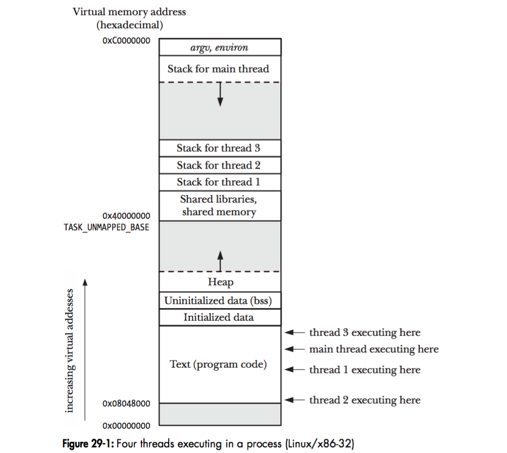


## Environment Version

+ VM: [Oracle VirtualBox 7.0.12 r159484](https://download.virtualbox.org/virtualbox/7.0.12/)
+ OS: [Ubuntu 14.04.6 LTS (Trusty Tahr) 32-bit PC (i386) desktop image](https://releases.ubuntu.com/trusty/)
+ Kernel: [linux-3.9.9](https://mirrors.edge.kernel.org/pub/linux/kernel/v3.x/linux-3.9.9.tar.gz)


## Environmental Preparation

+ After adding a virtual machine in VirtualBox, you need to add super user permissions to the account first so that we can use sudo. You can use the following method to add it

    
    

## Adding New System Call

1. Download the source code for Linux kernel 3.9.9 and unzip it

    ``` bash
    ~$ cd Desktop
    ~/Desktop$ mkdir kernel
    ~/Desktop$ cd kernel/
    ~/Desktop/kernel$ wget https://mirrors.edge.kernel.org/pub/linux/kernel/v3.x/linux-3.9.9.tar.gz --no-check-certificate
    ~/Desktop/kernel$ tar zxvf linux-3.9.9.tar.gz 
    ```

2. Create a new directory named "virt_to_phy" within linux-3.9.9, and place the prepared system call code, [virt_to_phy.c](#實作程式碼), inside it. Then, add a Makefile with the entry `obj-y := virt_to_phy.o`

    ``` bash
    ~/Desktop/kernel/linux-3.9.9$ mkdir virt_to_phy
    ~/Desktop/kernel/linux-3.9.9$ cd virt_to_phy/
    ~/Desktop/kernel/linux-3.9.9/virt_to_phy$ gedit virt_to_phy.c
    ~/Desktop/kernel/linux-3.9.9/virt_to_phy$ gedit Makefile
    ```
    
    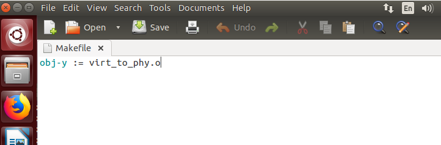

3. Modify the Makefile in "linux-3.9.9" to locate "core-y" under ifeq ($(KBUILD_EXTMOD),) and add the newly created directory, "virt_to_phy/", at the end
    
    ``` bash
    ~/Desktop/kernel/linux-3.9.9/virt_to_phy$ cd ..
    ~/Desktop/kernel/linux-3.9.9$ gedit Makefile
    ```
    
    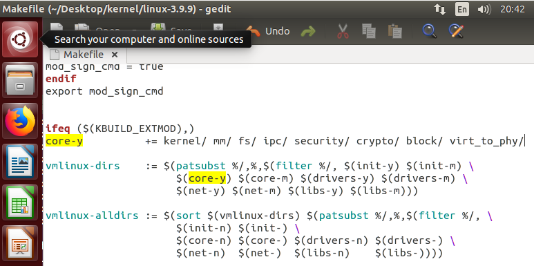

4. Add the new system call to the last line of the "syscall_32.tbl" file

    ``` bash
    ~/Desktop/kernel/linux-3.9.9$ gedit arch/x86/syscalls/syscall_32.tbl 
    ```
    
    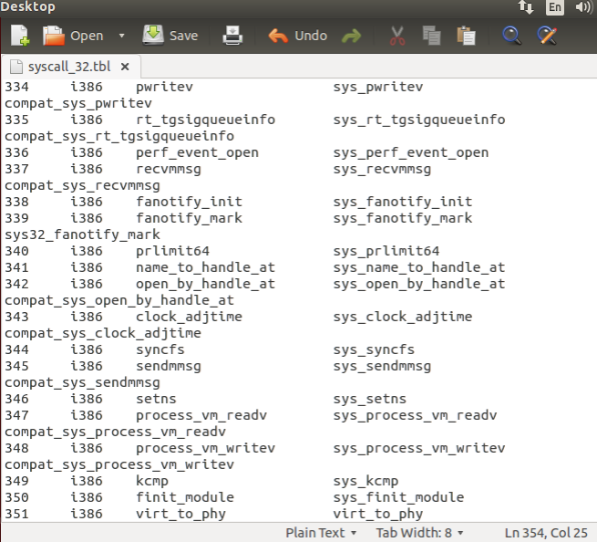

5. Add the new system call before the last line containing #endif in the "syscalls.h" file

    ``` bash
    ~/Desktop/kernel/linux-3.9.9$ gedit include/linux/syscalls.h
    ```

    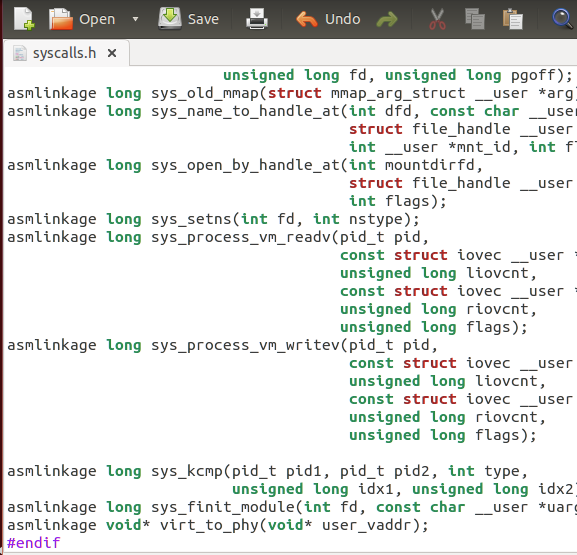


## Compile Kernel

1. Install the required packages

    ``` bash
    ~/Desktop/kernel/linux-3.9.9$ sudo apt-get update -y
    ~/Desktop/kernel/linux-3.9.9$ sudo apt-get install build-essential libncurses5 libncurses5-dev -y
    ```

2. Configure the compilation options
    
    ``` bash
    ~/Desktop/kernel/linux-3.9.9$ make menuconfig
    ```

    Disable "Supervisor Mode Access Prevention" under "Processor type and features." This setting prevents direct access between user-space and kernel-space memory. Once done, save and exit to apply the changes.

3. Compile and Install

    Once the setup is complete, proceed with compilation. Use '-j' to specify the number of cores utilized during compilation; theoretically, more cores lead to faster compilation. After compilation, proceed directly with installation.

    ``` bash
    ~/Desktop/kernel/linux-3.9.9$ sudo make -j8
    ~/Desktop/kernel/linux-3.9.9$ sudo make modules_install -j8
    ~/Desktop/kernel/linux-3.9.9$ sudo make install -j8
    ```

4. Modify grub

    Modify "/etc/default/grub" to enable the selection of our self-installed kernel during boot-up.

    ``` bash
    ~/Desktop/kernel/linux-3.9.9$ sudo gedit /etc/default/grub
    ```

    

    Locate the section in the file as shown in the upper image and modify it to match the following image.

    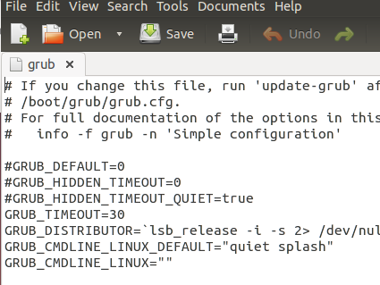

    Finally, update GRUB and reboot. You'll see a screen like the one in the image below. Enter "Advanced options for Ubuntu" and select the kernel you just installed.
    
    ``` bash
    ~/Desktop/kernel/linux-3.9.9$ sudo update-grub
    ~/Desktop/kernel/linux-3.9.9$ sudo reboot
    ```
    
    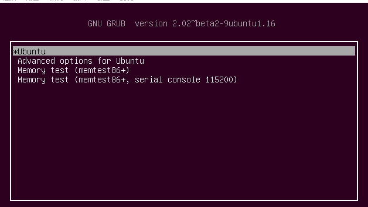

5. Verify if the kernel installation was successful

    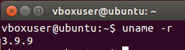


## Implement the System Call

+ ### Describe
    
    
    Firstly, it's important to understand the paging mechanism used in the Linux kernel. Since Linux kernel version 2.6.11, it adopted a 4-level paging structure ([Ref. 3](https://hackmd.io/@harunanase/ryMdN1gDV#Paging-in-Linux)), as illustrated below.

    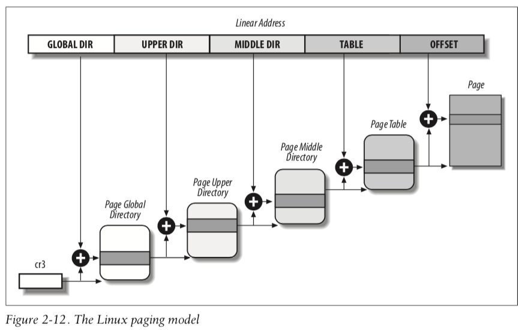
    
    
    However, based on the architecture and configuration, there are slight differences. Taking the current 32-bit kernel as an example, it employs a 2-level paging structure consisting only of a page global directory and page table ([Ref. 3](https://hackmd.io/@harunanase/ryMdN1gDV#Paging-in-Linux)), as depicted below.

    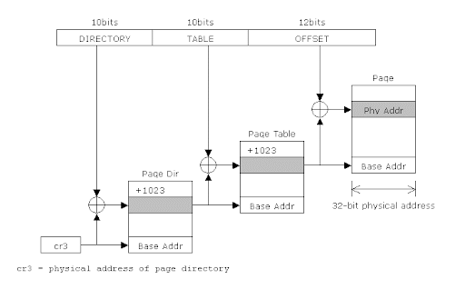

    Additionally, starting from Linux kernel 2.2.23, full PAE (Physical Address Extension) support began, and most Linux distributions have it enabled by default ([Ref. 4](https://en.wikipedia.org/wiki/Physical_Address_Extension#Linux)). Consequently, the structure would differ again, as shown below.

    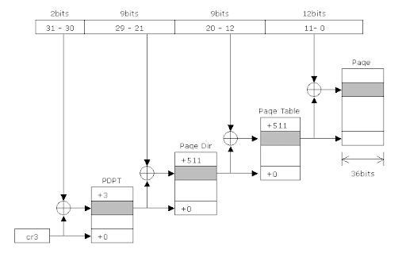

    Due to varying architectures and configurations, Linux automatically performs certain handling to ensure universality. Therefore, in our implementation, we primarily focus on implementing the 4-level paging mechanism.

    In the implementation, it's only necessary to continuously call the functions provided by the kernel, step by step, to retrieve its address ([Ref. 6](https://www.kernel.org/doc/gorman/html/understand/understand006.html)).

+ ### Implementation of the code

    ``` C
    #include <linux/init_task.h>
    #include <linux/kernel.h>
    #include <linux/module.h>
    #include <linux/string.h>
    #include <linux/uaccess.h>
    #include <linux/mm.h>
    #include <linux/linkage.h>
    #include <linux/highmem.h>
    #include <linux/gfp.h>

    asmlinkage void* virt_to_phy(void* user_vaddr) {
        pgd_t *pgd;
        pud_t *pud;
        pmd_t *pmd;
        pte_t *pte;

        printk("\ninput virtual address: 0x%p\n", user_vaddr);

        unsigned long vaddr = (unsigned long)user_vaddr;
        printk("vaddr: 0x%p\n", vaddr);

        // page global directory
        pgd = pgd_offset(current->mm, vaddr);
        printk("pgd_val = 0x%lx\n", pgd_val(*pgd));
        printk("pgd_index = %lu\n", pgd_index(vaddr));
        if (pgd_none(*pgd)) {
            printk("Not mapped in pgd!\n");
            return (void*)0;
        }

        // page upper directory
        pud = pud_offset(pgd, vaddr);
        printk("pud_val = 0x%lx\n", pud_val(*pud));
        if (pud_none(*pud)) {
            printk("Not mapped in pud!\n");
            return (void*)0;
        }

        // page middle directory
        pmd = pmd_offset(pud, vaddr);
        printk("pmd_val = 0x%lx\n", pmd_val(*pmd));
        printk("pmd_index = %lu\n", pmd_index(vaddr));
        if (pmd_none(*pmd)) {
            printk("Not mapped in pmd!\n");
            return (void*)0;
        }

        // page table
        pte = pte_offset_map(pmd, vaddr);
        printk("pte_val = 0x%lx\n", pte_val(*pte));
        printk("pte_index = %lu\n", pte_index(vaddr));
        if (pte_none(*pte)) {
            printk("Not mapped in pte!\n");
            return (void*)0;
        }

        struct page *page = pte_page(*pte);
        pte_unmap(pte);
        unsigned long page_address = page_to_phys(page);
        printk("paddr: 0x%p\n", page_address);

        unsigned long page_offset = vaddr & ~PAGE_MASK;
        unsigned long physical_address = page_address | page_offset;

        printk("page_address = 0x%p, page_offset = %lx\n", page_address, page_offset);
        printk("virtual_address = 0x%p, physical_address = 0x%p\n", vaddr, physical_address);

        return (void*)physical_address;
    }
    ```

+ ### Run and test

    ``` C
    #include <stdio.h>
    #include <sys/syscall.h>

    int main()
    {
        int a = 10;
        printf("virtual address: %p\nphysical address: %p\n", &a, syscall(351, &a));
    }
    ```

    Compile and execute after compilation.

    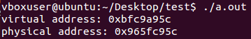

    View kernel messages using `dmesg`.

    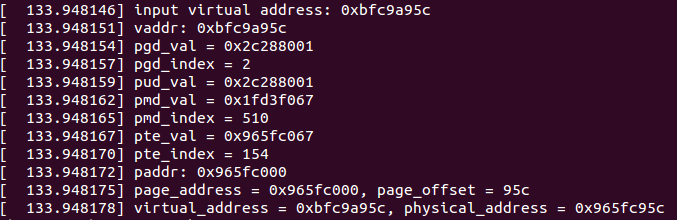
    
    It can be observed that the values of PGD and PUD are the same, indicating that the PUD is currently unused, aligning with the previously discussed 32-bit PAE-enabled paging structure.
    

## Implementation of a Multi-threaded Program and Memory Allocation Diagram

+ ### Describe

    Modify the multi-thread program provided by the instructor to inspect the allocation status of code segments, data segments, BSS segments, heap segments, libraries, stack segments, and thread-local storage. Utilize the custom-made system call to retrieve their physical addresses.

+ ### Implementation of the code

    ``` C
    #include <stdio.h>
    #include <pthread.h>
    #include <string.h>
    #include <sys/syscall.h> /* Definition of SYS_* constants */
    #include <unistd.h>

    pthread_mutex_t mutex = PTHREAD_MUTEX_INITIALIZER;

    extern void *func1(void *);
    extern void *func2(void *);
    extern void *func3(void *);
    extern int main();
    void * my_get_physical_addresses(void* vaddr)
    {
        return syscall(351, vaddr);
    }

    struct data_
    {
        int id;
        char name[16];
    };
    typedef struct data_ sdata;
    static __thread sdata tx; // thread local variable

    // bss
    int c;
    int k;

    // heap
    int *p;
    int *p2;

    int a = 123; // global variable

    void hello(int pid)
    {
        // local varialbe
        int b = 10;
        b = b + pid;

        // global variable
        printf("In thread %d \na = %d, logical address = %p, ", pid, a, &a);
        printf("physical address = %p\n", my_get_physical_addresses(&a));
        // local variable
        printf("b = %d, logical address = %p, ", b, &b);
        printf("physical address = %p\n", my_get_physical_addresses(&b));
        // thread local variable
        printf("tx: logical address = %p, ", &tx);
        printf("physical address = %p\n", my_get_physical_addresses(&tx));
        // heap
        printf("heap p: local address = %p, ", p);
        printf("physical address = %p\n", my_get_physical_addresses(p));
        printf("heap &p: local address = %p, ", &p);
        printf("physical address = %p\n", my_get_physical_addresses(&p));
        printf("heap p2: local address = %p, ", p2);
        printf("physical address = %p\n", my_get_physical_addresses(p2));
        printf("heap &p2: local address = %p, ", &p2);
        printf("physical address = %p\n", my_get_physical_addresses(&p2));
        // bss
        printf("bss c: local address = %p, ", &c);
        printf("physical address = %p\n", my_get_physical_addresses(&c));
        printf("bss k: local address = %p, ", &k);
        printf("physical address = %p\n", my_get_physical_addresses(&k));
        // function
        printf("hello: logical address = %p, ", hello);
        printf("physical address = %p\n", my_get_physical_addresses(hello));
        printf("func1: logical address = %p, ", func1);
        printf("physical address = %p\n", my_get_physical_addresses(func1));
        printf("func2: logical address = %p, ", func2);
        printf("physical address = %p\n", my_get_physical_addresses(func2));
        printf("func3: logical address = %p, ", func3);
        printf("physical address = %p\n", my_get_physical_addresses(func3));
        printf("main: logical address = %p, ", main);
        printf("physical address = %p\n", my_get_physical_addresses(main));
        // library function
        printf("printf: logical address = %p, ", printf);
        printf("physical address = %p\n", my_get_physical_addresses(printf));
        printf("====================================================================================================================\n");
    }

    void *func1(void *arg)
    {
        char *p = (char *)arg;
        int pid;
        pid = syscall(__NR_gettid);
        tx.id = pid;
        strcpy(tx.name, p);

        pthread_mutex_lock(&mutex);
        printf("I am thread with ID %d executing func1().\n", pid);
        hello(pid);
        pthread_mutex_unlock(&mutex);

        while (1)
        {
            // printf("(%d)(%s)\n",tx.id,tx.name) ;
            sleep(1);
        }
    }

    void *func2(void *arg)
    {
        char *p = (char *)arg;
        int pid;
        pid = syscall(__NR_gettid);
        tx.id = pid;
        strcpy(tx.name, p);

        pthread_mutex_lock(&mutex);
        printf("I am thread with ID %d executing func2().\n", pid);
        hello(pid);
        pthread_mutex_unlock(&mutex);

        while (1)
        {
            // printf("(%d)(%s)\n",tx.id,tx.name) ;
            sleep(2);
        }
    }

    void *func3(void *arg)
    {
        char *p = (char *)arg;
        int pid;
        pid = syscall(__NR_gettid);
        tx.id = pid;
        strcpy(tx.name, p);

        pthread_mutex_lock(&mutex);
        printf("I am thread with ID %d executing func3().\n", pid);
        hello(pid);
        pthread_mutex_unlock(&mutex);

        while (1)
        {
            // printf("(%d)(%s)\n",tx.id,tx.name) ;
            sleep(3);
        }
    }

    int main()
    {
        p = malloc(10 * sizeof(int));
        p2 = malloc(20 * sizeof(int));

        pthread_t id[3];
        char p[3][16];
        strcpy(p[0], "Thread1");
        pthread_create(&id[0], NULL, func1, (void *)p[0]);
        strcpy(p[1], "Thread2");
        pthread_create(&id[1], NULL, func2, (void *)p[1]);
        strcpy(p[3], "Thread3");
        pthread_create(&id[2], NULL, func3, (void *)p[2]);

        int pid;
        pid = syscall(__NR_gettid);
        tx.id = pid;
        strcpy(tx.name, "MAIN");

        pthread_mutex_lock(&mutex);
        printf("I am main thread with ID %d.\n", pid);
        hello(pid);
        pthread_mutex_unlock(&mutex);

        while (1)
        {
            // printf("(%d)(%s)\n",tx.id,tx.name) ;
            sleep(5);
        }

        free(p);
        free(p2);
    }
    ```

+ ### Memory allocation status during execution

    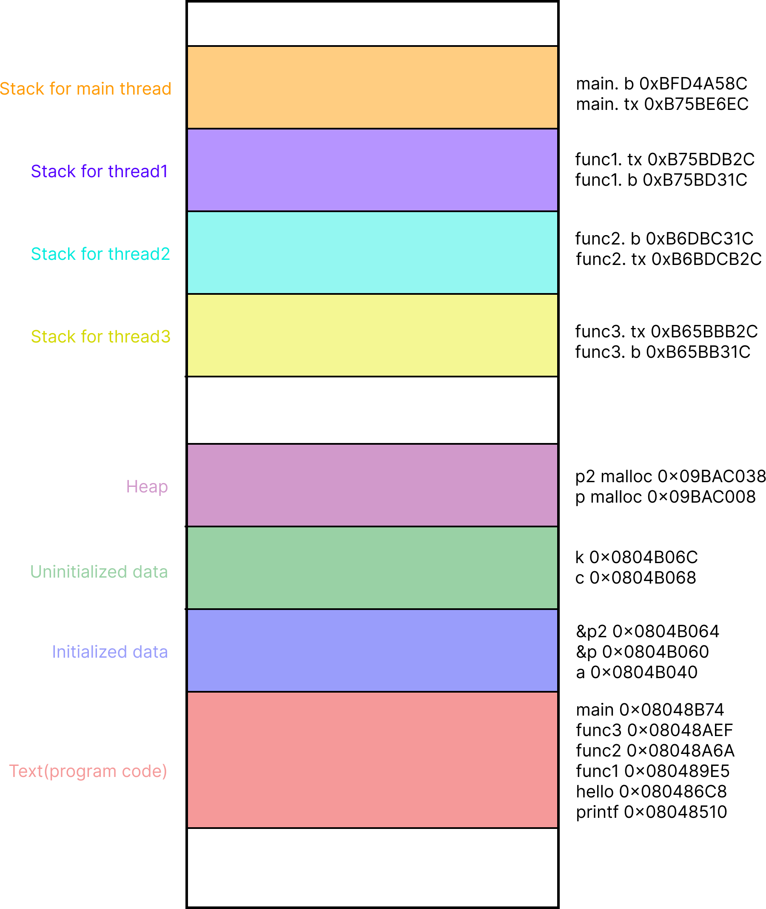

## The encountered issues and their resolutions (referenced data and source code)

+ ### Issues Encountered

    + #### After compiling and installing the kernel, the selected kernel fails to boot

        Initially used VMware Workstation 17 Player for emulation but encountered boot issues after compiling and installing the kernel. Switching to Oracle VirtualBox resolved the problem.

+ ### References

    1. [Ubuntu - How can I make my own account a sudoers on VirtualBox?](https://superuser.com/a/1755286)
    2. [編譯linux kernel 版本(System call). This is NCU Linux Kernel First… ](https://medium.com/@lars10192002/%E7%B7%A8%E8%AD%AFlinux-kernel-%E7%89%88%E6%9C%AC-system-call-83c8ebbae62f)
    3. [Memory Paging - HackMD](https://hackmd.io/@harunanase/ryMdN1gDV#Paging-in-Linux)
    4. [Physical Address Extension - Wikipedia](https://en.wikipedia.org/wiki/Physical_Address_Extension#Linux)
    5. [IA32 Paging Architecture](https://neokentblog.blogspot.com/2008/01/ia32-paging-architecture.html)
    6. [Paging Table Management](https://www.kernel.org/doc/gorman/html/understand/understand006.html)
    7. [linux kernel - how to get physical address (memory management)?](https://stackoverflow.com/questions/41090469/linux-kernel-how-to-get-physical-address-memory-management)
